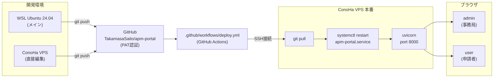

# ARCHITECTURE.md — apm-portal

## 構成図



## 技術スタック

| レイヤー | 技術 |
|---------|------|
| バックエンド | FastAPI (Python) |
| データベース | SQLite (`data/apm.db`) |
| フロントエンド | Vanilla JS 単一HTML (`frontend/index.html` 約6,400行) |
| 認証 | JWT |
| グラフ | Chart.js (CDN: cdnjs) |

## デプロイ先とURL

- **本番**: `http://160.251.252.203:8000`（ConoHa VPS 1GB/2Core、Ubuntu 24.04、`/opt/apm-portal`）
  - プロセス管理: `systemd` (`apm-portal.service` → uvicorn)
- **ドメイン**: `ea-journey.com` 取得済み・Aレコード設定済み（反映待ち）
  - HTTPS化（nginx + certbot）は [Issue #1](https://github.com/TakamasaSaito/apm-portal/issues/1)
- **旧環境**: Railway（Trial終了により停止。`docs/decisions/001` 参照）

## 外部依存

- **ConoHa VPS** — 本番ホスティング（¥660/月）
- **GitHub Actions** — 自動デプロイ。Secrets: `VPS_SSH_KEY` / `VPS_HOST` / `VPS_USER`
- **Chart.js CDN** — cdnjs経由でフロントエンドに読み込み
- **Claude API** — デマンド審査タスクの自動生成
- **ConoHa DNS** — `ea-journey.com` のゾーン管理

## データの流れ

```
ブラウザ
  → JWT認証付き REST API（/api/*）
    → SQLite（data/apm.db）
```

- 起動時に `scripts/seed.py` が全サンプルデータを投入
- CSDM型リレーション（`cmdb_rel_ci` テーブル）でアプリ↔環境↔CIを紐付け
